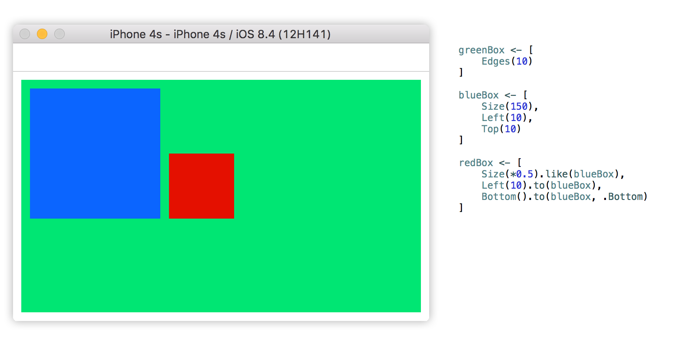

[](https://travis-ci.org/nakiostudio/EasyPeasy)
[](http://cocoapods.org/pods/EasyPeasy)
[](http://cocoapods.org/pods/EasyPeasy)
[](http://cocoadocs.org/docsets/EasyPeasy)

**EasyPeasy** is a Swift framework that lets you create *Autolayout* constraints
programmatically without headaches and never ending boilerplate code. Besides the
basics, **EasyPeasy** resolves most of the constraint conflicts for you and lets
you attach to a constraint conditional closures that are evaluated before applying
a constraint, this lets you apply (or not) a constraint depending on platform, size
classes, orientation... or the state of your controller, easy peasy!

In this quick tour through **EasyPeasy** we assume that you already know the
advantages and disadvantages of the different *Autolayout* APIs and therefore you
won't see here a comparison of the code side by side, just read and decide
whether **EasyPeasy** is for you or not.

### A touch of EasyPeasy
The example below is quite simple but shows how effortless its implementation
result using **EasyPeasy**.


## Table of contents

* [Installation](https://github.com/nakiostudio/EasyPeasy#installation)
* [Usage](https://github.com/nakiostudio/EasyPeasy#usage)
	* [Modifiers](https://github.com/nakiostudio/EasyPeasy#modifiers)
	* [Attributes](https://github.com/nakiostudio/EasyPeasy#attributes)
		* [DimensionAttributes](https://github.com/nakiostudio/EasyPeasy#dimensionattributes)
		* [PositionAttributes](https://github.com/nakiostudio/EasyPeasy#positionattributes)
		* [CompoundAttributes](https://github.com/nakiostudio/EasyPeasy#compoundattributes)
	* [Priorities](https://github.com/nakiostudio/EasyPeasy#priorities)
	* [Conditions](https://github.com/nakiostudio/EasyPeasy#conditions)
	* [Lastly](https://github.com/nakiostudio/EasyPeasy#lastly)
		* [Updating constraints](https://github.com/nakiostudio/EasyPeasy#updating-constraints)
		* [Animating constraints](https://github.com/nakiostudio/EasyPeasy#animating-constraints)
* [Example project](https://github.com/nakiostudio/EasyPeasy#example-project)

## Installation

### Cocoapods
EasyPeasy is available through [CocoaPods](http://cocoapods.org). To install
it, simply add the following line to your Podfile:

```ruby
pod "EasyPeasy"
```

### Compatibility
For now **EasyPeasy** is only compatible with iOS 8 and above, although we aim
to make it compatible with OS X.
The framework has been tested with Xcode 7 and Swift 2.0, however don't hesitate
to report any issues you may find with different versions.

## Usage

**EasyPeasy** is a set of position and dimension attributes that you can apply
to your views. For instance, to set a width of 200px to a view you would create
an attribute of class `Width` with a constant value of `200`, then the attribute
is applied to the view by using the custom *apply* operator `<-`.
```swift
myView <- Width(200)
```

Because our view without height is nothing we can apply multiple attributes at
once as follows:
```swift
myView <- [
	Width(200),
	Height(120)
]
```

In the previous example, two attributes have been applied and therefore two constraints
created and added: a width constraint with `constant = 200` and a height constraint
with `constant = 120`.

###Modifiers
Without really knowing it, we have just created an **EasyPeasy** `Constant`
struct containing the constant and the relation of a `NSLayoutConstraint`.
That relation is a `Modifier` and **EasyPeasy** provides four different modifiers:
* `.EqualTo`: the equivalent of `NSLayoutRelationEqual`, it's created like in
our previous example. `Width(200)`
* `.GreaterThanOrEqualTo`: the equivalent of `NSLayoutRelationGreaterThanOrEqual`,
it's created as easy as this `Width(>=200)` and it means that our view has a width
greater than or equal to 200px.
* `.LessThanOrEqualTo`: the equivalent of `NSLayoutRelationLessThanOrEqual`
is created as follows `Width(<=200)`.
* `.MultipliedBy`: this modifier is a bit particular as it does not match any
`NSLayoutRelation`, instead, this modifier replaces the `multiplier` property
of a `NSLayoutConstraint`. It's created like this `Width(*2)` and means that the
width of our view is two times *something*, we will mention later how to establish
the relationship with that *something*.

###Attributes
**EasyPeasy** provides as many `Attribute` classes as attributes `NSLayoutConstraint`
have, plus something that we have called `CompoundAttributes` (we will explain these
attributes later).

####DimensionAttributes
There are just two dimension attributes `Width` and `Height`. You can create an
*Autolayout* relationship between your view `DimensionAttribute` and another view
by using the method `like(view: UIView)`. Example:
```swift
contentLabel <- Width().like(headerView)
```

That line of code will create a constraint that sets a width for `contentLabel`
equal to the `headerView` width.

It's possible to create that relationship with any attribute of the reference
view, for example the following piece of code will create a constraint setting a
width for `contentLabel` equal to the height of `headerView`.
```swift
contentLabel <- Width().like(headerView, .Height)
```

####PositionAttributes
The table below shows the different position attributes available. Because they
behave like the `NSLayoutConstraint` attributes, you can find a complete
description of them in the [Apple docs](https://developer.apple.com/library/ios/documentation/AppKit/Reference/NSLayoutConstraint_Class/#//apple_ref/c/tdef/NSLayoutRelation).

Attribute | Attribute | Attribute | Attribute
--- | --- | --- | ---
Left | Right | Top | Bottom
Leading | Trailing | CenterX | CenterY
LeftMargin | RightMargin | TopMargin | BottomMargin
LeadingMargin | TrailingMargin | CenterXWithinMargins | CenterYWithinMargins
FirstBaseline | LastBaseline | -- | --

As well as the **DimensionAttributes** have the `like:` method to establish
*Autolayout* relationships, you can use a similar method to do the same with
**PositionAttributes**. This method is `to(view: UIView)`.

The example below positions `contentLabel` 10px under `headerView` with the same
left margin as `headerView`.
```swift
contentLabel <- [
	Top(10).to(headerView),
	Left().to(headerView, .Left)
]
```

####CompoundAttributes
These attributes are the ones that create multiple `DimensionAttributes` or
`PositionAttributes` under the hood. For example, the `Size` attribute will create
a `Width` and a `Height` attributes with their width and height
`NSLayoutConstraints` respectively.

These are the `CompoundAttributes` available:

* `Size`: As mentioned before this attribute will apply a `Width` and a `Height`
attribute to the view. It can be initialized in many ways and depending on that
the result may change. These are some examples:
```swift
// Apply width = 0 and height = 0 constraints
view <- Size()
// Apply width = referenceView.width and height = referenceView.height constraints
view <- Size().like(referenceView)
// Apply width = 100 and height = 100 constraints
view <- Size(100)
// Apply width = 200 and height = 100 constraints
view <- Size(CGSize(width: 200, height: 100))
```

* `Edges`: This attribute creates `Left`, `Right`, `Top` and `Bottom` attributes
at once. Examples:
```swift
// Apply left = 0, right = 0, top = 0 and bottom = 0 constraints to its superview
view <- Edges()
// Apply left = 10, right = 10, top = 10 and bottom = 10 constraints to its superview
view <- Edges(10)
// Apply left = 10, right = 10, top = 5 and bottom = 5 constraints to its superview
view <- Edges(UIEdgeInsets(top: 5, left: 10, bottom: 5, right: 10))
```

* `Center`: It creates `CenterX` and `CenterY` attributes. Examples:
```swift
// Apply centerX = 0 and centerY = 0 constraints to its superview
view <- Center()
// Apply centerX = 10 and centerY = 10 constraints to its superview
view <- Center(10)
// Apply centerX = 0 and centerY = 50 constraints to its superview
view <- Center(CGPoint(x: 0, y: 50))
```

* `Margins`: This attribute creates `LeftMargin`, `RightMargin`, `TopMargin` and
`BottomMargin` attributes at once. Examples:
```swift
// Apply leftMargin = 0, rightMargin = 0, topMargin = 0 and bottomMargin = 0 constraints to its superview
view <- Margins()
// Apply leftMargin = 10, rightMargin = 10, topMargin = 10 and bottomMargin = 10 constraints to its superview
view <- Margins(10)
// Apply leftMargin = 10, rightMargin = 10, topMargin = 5 and bottomMargin = 5 constraints to its superview
view <- Margins(UIEdgeInsets(top: 5, left: 10, bottom: 5, right: 10))
```

* `CenterWithinMargins`: It creates `CenterXWithinMargins` and `CenterYWithinMargins`
attributes. Examples:
```swift
// Apply centerXWithinMargins = 0 and centerYWithinMargins = 0 constraints to its superview
view <- CenterWithinMargins()
// Apply centerXWithinMargins = 10 and centerYWithinMargins = 10 constraints to its superview
view <- CenterWithinMargins(10)
// Apply centerXWithinMargins = 0 and centerYWithinMargins = 50 constraints to its superview
view <- CenterWithinMargins(CGPoint(x: 0, y: 50))
```

###Priorities
*W.I.P*

###Conditions
*W.I.P*

###Lastly
*W.I.P*

####Updating constraints
*W.I.P*

####Animating constraints
*W.I.P*

##Example project

*W.I.P*

## Author

Carlos Vidal - [@carlostify](https://twitter.com/carlostify)

## License

EasyPeasy is available under the MIT license. See the LICENSE file for more info.
