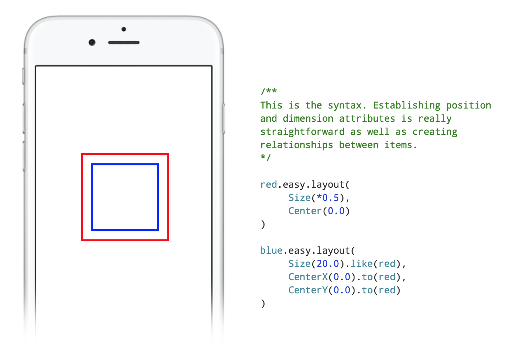

[](https://travis-ci.org/nakiostudio/EasyPeasy)
[](http://cocoapods.org/pods/EasyPeasy)
[](https://github.com/Carthage/Carthage)
[](https://travis-ci.org/nakiostudio/EasyPeasy)
[](http://cocoadocs.org/docsets/EasyPeasy)

**EasyPeasy** is a Swift framework that lets you create *Auto Layout* constraints
programmatically without headaches and never ending boilerplate code. Besides the
basics, **EasyPeasy** resolves most of the constraint conflicts for you and also
can attach to a constraint conditional closures that are evaluated before applying
a constraint, this way you can install an *Auto Layout* constraint depending on
platform, size classes, orientation... or the state of your controller, easy peasy!

In this quick tour through **EasyPeasy** we assume that you already know the
advantages and disadvantages of the different *Auto Layout* APIs and therefore you
won't see here a comparison of the code side by side, just read and decide
whether **EasyPeasy** is for you or not.

### A touch of EasyPeasy
The example below is quite simple but shows how effortless its implementation
result using **EasyPeasy**.


### Features

* Lightweight and easy to use domain specific language.
* Resolution of *Auto Layout* conflicts.
* Fast and *hassle-free* update of constraints.
* Conditional application of constraints.
* `UILayoutGuide` support (iOS 9 and above).

## Table of contents

* [Installation](#installation)
* [Usage](#usage)
	* [Modifiers](#modifiers)
	* [Attributes](#attributes)
		* [DimensionAttributes](#dimensionattributes)
		* [PositionAttributes](#positionattributes)
		* [CompoundAttributes](#compoundattributes)
	* [Priorities](#priorities)
	* [Conditions](#conditions)
	* [UILayoutGuides](#uilayoutguides)
	* [Lastly](#lastly)
		* [Updating constraints](#updating-constraints)
		* [Clearing constraints](#clearing-constraints)
		* [Animating constraints](#animating-constraints)
* [Example project](#example-project)
* [EasyPeasy playground](#easypeasy-playground)
* [Autogenerated documentation](#autogenerated-documentation)

## Installation

### Cocoapods
EasyPeasy is available through [CocoaPods](http://cocoapods.org). To install
it, simply add the following line to your Podfile:

```ruby
pod "EasyPeasy"
```

### Carthage
EasyPeasy is [Carthage](https://github.com/Carthage/Carthage) compatible.
To add **EasyPeasy** as a dependency to your project, just add the following line
to your Cartfile:

```ruby
github "nakiostudio/EasyPeasy"
```
And run ` carthage update ` as usual.

### Compatibility
For now **EasyPeasy** is only compatible with iOS 8 and above, although we aim
to make it compatible with OS X.
The framework has been tested with Xcode 7 and Swift 2.0, however don't hesitate
to report any issues you may find with different versions.

## Usage

**EasyPeasy** is a set of position and dimension attributes that you can apply
to your views. For instance, to set a width of 200px to a view you would create
an attribute of class `Width` with a constant value of `200`, then the attribute
is applied to the view by using the custom *apply* operator `<-`.
```swift
myView <- Width(200)
```

Because our view without height is nothing we can apply multiple attributes at
once as follows:
```swift
myView <- [
	Width(200),
	Height(120)
]
```

In the previous example, two attributes have been applied and therefore two constraints
created and added: a width constraint with `constant = 200` and a height constraint
with `constant = 120`.

### Modifiers
Without really knowing it, we have just created an **EasyPeasy** `Constant`
struct containing the constant and the relation of a `NSLayoutConstraint`.
That relation is a `Modifier` and **EasyPeasy** provides four different modifiers:
* `.EqualTo`: the equivalent of `NSLayoutRelationEqual`, it's created like in
our previous example. `Width(200)`
* `.GreaterThanOrEqualTo`: the equivalent of `NSLayoutRelationGreaterThanOrEqual`,
it's created as easy as this `Width(>=200)` and it means that our view has a width
greater than or equal to 200px.
* `.LessThanOrEqualTo`: the equivalent of `NSLayoutRelationLessThanOrEqual`
is created as follows `Width(<=200)`.
* `.MultipliedBy`: this modifier is a bit particular as it does not match any
`NSLayoutRelation`, instead, this modifier replaces the `multiplier` property
of a `NSLayoutConstraint`. It's created like this `Width(*2)` and means that the
width of our view is two times *something*, we will mention later how to establish
the relationship with that *something*.

### Attributes
**EasyPeasy** provides as many `Attribute` classes as attributes `NSLayoutConstraint`
have, plus something that we have called `CompoundAttributes` (we will explain these
attributes later).

#### DimensionAttributes
There are just two dimension attributes `Width` and `Height`. You can create an
*Auto Layout* relationship between your view `DimensionAttribute` and another view
by using the method `func like(view: UIView) -> Self`. Example:
```swift
contentLabel <- Width().like(headerView)
```

That line of code will create a constraint that sets a width for `contentLabel`
equal to the `headerView` width.

#### PositionAttributes
The table below shows the different position attributes available. Because they
behave like the `NSLayoutConstraint` attributes, you can find a complete
description of them in the [Apple docs](https://developer.apple.com/library/ios/documentation/AppKit/Reference/NSLayoutConstraint_Class/#//apple_ref/c/tdef/NSLayoutRelation).

Attribute | Attribute | Attribute | Attribute
--- | --- | --- | ---
Left | Right | Top | Bottom
Leading | Trailing | CenterX | CenterY
LeftMargin | RightMargin | TopMargin | BottomMargin
LeadingMargin | TrailingMargin | CenterXWithinMargins | CenterYWithinMargins
FirstBaseline | LastBaseline | -- | --

As well as the **DimensionAttributes** have the `like:` method to establish
*Auto Layout* relationships, you can use a similar method to do the same with
**PositionAttributes**. This method is:
```swift
func to(view: UIView, _ attribute: ReferenceAttribute? = nil) -> Self
```

The example below positions `contentLabel` 10px under `headerView` with the same
left margin as `headerView`.
```swift
contentLabel <- [
	Top(10).to(headerView),
	Left().to(headerView, .Left)
]
```

#### CompoundAttributes
These attributes are the ones that create multiple `DimensionAttributes` or
`PositionAttributes` under the hood. For example, the `Size` attribute will create
a `Width` and a `Height` attributes with their width and height
`NSLayoutConstraints` respectively.

These are the `CompoundAttributes` available:

* `Size`: As mentioned before this attribute will apply a `Width` and a `Height`
attribute to the view. It can be initialized in many ways and depending on that
the result may change. These are some examples:
```swift
// Apply width = 0 and height = 0 constraints
view <- Size()
// Apply width = referenceView.width and height = referenceView.height constraints
view <- Size().like(referenceView)
// Apply width = 100 and height = 100 constraints
view <- Size(100)
// Apply width = 200 and height = 100 constraints
view <- Size(CGSize(width: 200, height: 100))
```

* `Edges`: This attribute creates `Left`, `Right`, `Top` and `Bottom` attributes
at once. Examples:
```swift
// Apply left = 0, right = 0, top = 0 and bottom = 0 constraints to its superview
view <- Edges()
// Apply left = 10, right = 10, top = 10 and bottom = 10 constraints to its superview
view <- Edges(10)
// Apply left = 10, right = 10, top = 5 and bottom = 5 constraints to its superview
view <- Edges(UIEdgeInsets(top: 5, left: 10, bottom: 5, right: 10))
```

* `Center`: It creates `CenterX` and `CenterY` attributes. Examples:
```swift
// Apply centerX = 0 and centerY = 0 constraints to its superview
view <- Center()
// Apply centerX = 10 and centerY = 10 constraints to its superview
view <- Center(10)
// Apply centerX = 0 and centerY = 50 constraints to its superview
view <- Center(CGPoint(x: 0, y: 50))
```

* `Margins`: This attribute creates `LeftMargin`, `RightMargin`, `TopMargin` and
`BottomMargin` attributes at once. Examples:
```swift
// Apply leftMargin = 0, rightMargin = 0, topMargin = 0 and bottomMargin = 0 constraints to its superview
view <- Margins()
// Apply leftMargin = 10, rightMargin = 10, topMargin = 10 and bottomMargin = 10 constraints to its superview
view <- Margins(10)
// Apply leftMargin = 10, rightMargin = 10, topMargin = 5 and bottomMargin = 5 constraints to its superview
view <- Margins(UIEdgeInsets(top: 5, left: 10, bottom: 5, right: 10))
```

* `CenterWithinMargins`: It creates `CenterXWithinMargins` and `CenterYWithinMargins`
attributes. Examples:
```swift
// Apply centerXWithinMargins = 0 and centerYWithinMargins = 0 constraints to its superview
view <- CenterWithinMargins()
// Apply centerXWithinMargins = 10 and centerYWithinMargins = 10 constraints to its superview
view <- CenterWithinMargins(10)
// Apply centerXWithinMargins = 0 and centerYWithinMargins = 50 constraints to its superview
view <- CenterWithinMargins(CGPoint(x: 0, y: 50))
```

### Priorities

The `Priority` enum does the same function as `UILayoutPriority` and it's shaped
by four cases:
* `LowPriority`: it creates an *Auto Layout* priority with `Float` value `1`.

* `MediumPriority`: it creates an *Auto Layout* priority with `Float` value `500`.

* `HighPriority`: it creates an *Auto Layout* priority with `Float` value `1000`.

* `CustomPriority`: it specifies the *Auto Layout* priority defined by the
developer in the case associated value `value`. Example: `.CustomPriority(value: 750.0)`

In order to apply any of these priorities to an `Attribute`, the method
`.with(priority: Priority)` must be used. The following example gives an
`UILayoutPriority` of `500` to the `Top` `Attribute` applied to `view`:

```swift
view <- Top(>=50).with(.MediumPriority)
```

You can also apply a `Priority` to an array of `Attributes` (this operation will
override the priorities previously applied to an `Attribute`).

```swift
view <- [
	Width(200),
	Height(200)
].with(.MediumPriority)
```

### Conditions
One of the peculiarities of **EasyPeasy** is the usage of `Conditions` or closures
that evaluate whether a constraint should be applied or not to the view.

The method `when(condition: Condition)` sets the `Condition` closure to an `Attribute`.

There is plenty of use cases, the example below shows how to apply different
constraints depending on the device:
```swift
view <- [
	Top(10),
	Bottom(10),
	Width(250),
	Left(10).when { Device() == .iPad },
	CenterX(0).when { Device() == .iPhone }
]
```

*Note:* the global function `Device()` in the example above is not implemented in
the framework.

These `Condition` closures can be re-evaluated during the lifecycle of an `UIView`,
to do so you just need to call the `UIView` convenience method `easy_reload()`.
```swift
view.easy_reload()
```

Bare in mind that these `Condition` closures are stored in properties therefore
you need to capture those variables you access within the closure. For example:
```swift
descriptionLabel <- [
	Height(100).when { [weak self] in
		return self?.expandDescriptionLabel ?? false
	}
]
```

You can also apply a `Condition` to an array of `Attributes` (this operation will
override the `Conditions` previously applied to an `Attribute`).

```swift
view <- [
	Width(200),
	Height(240)
].when { Device() == .iPad }

view <- [
	Width(120),
	Height(140)
].when { Device() == .iPhone }
```

### UILayoutGuides
Since the version *v.0.2.3* (and for iOS 9 projects and above) **EasyPeasy**
integrates `UILayoutGuides` support.

#### Applying constraints
Applying a constraint to an `UILayoutGuide` is as easy as we have discussed in the
previous sections, just apply the **EasyPeasy** attributes you want using the
apply operator `<-`.
```swift
func viewDidLoad() {
	super.viewDidLoad()

	let layoutGuide = UILayoutGuide()
	self.view.addLayoutGuide(layoutGuide)

	layoutGuide <- [
		Top(10),
		Left(10),
		Right(10),
		Height(100).when { Device() == .iPad },
		Height(60).when { Device() == .iPhone }
	]
}
```

As you can see, all the different attributes and goodies **EasyPeasy** provides for
`UIViews` are also applicable to `UILayoutGuides`.

#### Connecting UILayoutGuides and UIViews
As mentioned in the [Attributes](#attributes) section you can create constraint
relationships between an `UIView` attribute and other `UIViews` attributes using
the methods `to(_:_)` and `like(_:_)`. Now you can take advantage of those methods
to create a relationship between your `UIView` attributes and an `UILayoutGuide`.
```swift
let layoutGuide = UILayoutGuide()
let separatorView: UIView
let label: UILabel

func setupLabel() {
	self.label <- [
		Top(10).to(self.layoutGuide),
		CenterX(0),
		Size(60)
	]

	self.separatorView <- [
		Width(0).like(self.layoutGuide),
		Height(2),
		Top(10).to(self.label),
		CenterX(0).to(self.label)
	]
}
```

### Lastly
Finally but not less important in this section we will explain how to interact
with `Attributes` once they have been applied to an `UIView` using the `<-`
operator.

#### Updating constraints
We briefly mentioned in the introductory section that **EasyPeasy** solves most
of the constraint conflicts and it's true. Usually, in order to update a constraint
or the constant of a constraint you have to keep a reference to your
`NSLayoutConstraint` and update the constant when needed. With **EasyPeasy** you
just need to apply another `Attribute` to your `UIView` of the same or different
type. In the example below we have two methods, the one in which we setup our
constraints `viewDidLoad()` and a method in which we want to update the `Top`
attribute of our `headerView`.
```swift
func viewDidLoad() {
	super.viewDidLoad()

	headerView <- [
		Top(0),
		Left(0),
		Right(0),
		Height(60)
	]
}

func didTapButton(sender: UIButton?) {
	headerView <- Top(100)
}
```
That's it! we have updated our `Top` constraint without caring about keeping
references or installing/uninstalling new constraints.

However, there is some cases in which **EasyPeasy** cannot prevent a conflict (at
least for now). This is when multiple constraints cannot be satisfied, i.e. existing
a `Left` and `Right` constraints it's also applied a `Width` constraint (all of them
with the same priority). But **EasyPeasy** is smart enough to prevent conflicts,
i.e. when replacing a `Left` and `Right` attributes with a `CenterX` attribute.

#### Clearing constraints
**EasyPeasy** provides a method extending `UIView` that clears all the constraints
installed in an `UIView` by the framework. This method is `func easy_clear()`.
```swift
view.easy_clear()
```

#### Animating constraints
Animating constraints with **EasyPeasy** is very straightforward, just apply one
or more `Attributes` to your view within an animation block and you are ready to
go, without worrying about constraint conflicts. Example:
```swift
UIView.animateWithDuration(0.3) {
	view <- Top(10)
	view.layoutIfNeeded()
}
```

## Example project

Don't forget to clone the repository and run the example project to see
**EasyPeasy** in action.


*Note:* the messages in the demo app aren't real and the appearance of
those *Twitter* accounts no more than a tribute to some kickass developers :)

## EasyPeasy playground

Alternatively, you can play with **EasyPeasy** cloning the *Playground* project
available [here](https://github.com/nakiostudio/EasyPeasy-Playground).


## Autogenerated documentation

**EasyPeasy** is a well documented framework and therefore all the documented
classes and methods are available in [Cocoadocs](http://cocoadocs.org/docsets/EasyPeasy).

## Author

Carlos Vidal - [@carlostify](https://twitter.com/carlostify)

## License

EasyPeasy is available under the MIT license. See the LICENSE file for more info.
